# CallCenterTranscription

Architecture overview for the **call-center transcription and agent-assist POC**. This README is written for **architects and reviewers** who need the Azure system shape, runtime boundaries, and live-path trade-offs.

## Project overview

This project demonstrates a thin end-to-end path for a live inbound customer call:

- **Azure Communication Services (ACS)** receives and controls the call.
- The **API** answers the call, accepts ACS media streaming, and hosts the app's REST + **ASP.NET Core SignalR** surfaces.
- The API sends call audio and text through **Azure AI Speech**, **Azure AI Translator**, and a **reasoning seam that can call Azure AI Foundry / Azure AI Services-compatible endpoints** when configured.
- The **web frontend** shows transcript, translation, sentiment, and supporting guidance for the service representative.

The current runtime split is intentional:

- **API:** ASP.NET Core on **Azure Container Apps**
- **Web UI:** Razor Pages on **Azure App Service**
- **Real-time fan-out:** **SignalR hosted inside the API app** (not Azure SignalR Service)

## POC boundaries and non-goals

This repository is a **POC, not a production blueprint**.

Current IaC defaults are demo-oriented: API auth is disabled by default (`Security__RequireAuth=false`), live ACS audio is not enabled by default (`AudioSource__Mode=Mock`), ingress remains public, and Event Grid delivery uses plain webhook delivery. Those settings require security review and configuration changes before handling production customer data.

### In scope

- Prove the inbound-call topology: **ACS -> Event Grid -> API -> media stream -> AI pipeline -> web UI**.
- Keep mock and live modes swappable behind shared contracts.
- Show late-join/reconnect behavior through `/api/session/current-state` plus SignalR replay.
- Use Azure-hosted services and managed identity-oriented wiring without hardcoded secrets.

### Explicit non-goals

- Full production hardening, HA/DR, autoscale tuning, or cost optimization
- Exhaustive API/reference documentation
- Deep local setup or troubleshooting guidance
- Finalized authorization claims model for per-call/per-session access
- A completed Azure AI Foundry project/model lifecycle beyond the current POC deployment seam
- Azure SignalR Service, private networking everywhere, or full trusted webhook delivery hardening

## Azure architecture explanation

The POC keeps the live path as thin as possible.

1. **Inbound telephony:** ACS owns the phone-side experience. Event Grid forwards `IncomingCall` events to the API.
2. **Call control + ingress:** The API answers the call, starts ACS media streaming to its WebSocket endpoint, handles ACS mid-call callbacks, and can add the rep participant.
3. **Speech and language services:** Live call audio is pushed through Azure AI Speech; non-English utterances can be translated through Azure AI Translator.
4. **Reasoning seam:** The API can enrich the conversation with reasoning outputs when the Azure AI Foundry / Azure AI Services-compatible configuration is enabled. In this repo, that seam is deliberately conservative: the Azure AI Services account is provisioned, while the exact model deployment contract remains a post-provision step.
5. **Application state + fan-out:** The API owns the current-state snapshot and SignalR stream contract, then publishes updates to the web frontend.
6. **Frontend experience:** The App Service-hosted web app loads the current snapshot from the API, then stays current over SignalR.
7. **Operations:** Application Insights and Log Analytics provide the shared observability spine. Azure Container Registry supplies the API image. Key Vault is provisioned as the intended secret boundary for runtime secrets, and the repo intentionally avoids hardcoded secrets.

## Logical architecture

Diagram source: [`docs/assets/logical-architecture.mmd`](docs/assets/logical-architecture.mmd).

## Azure components in use

| Azure component | Role in the solution | Critical on live path? | Important caveats |
|---|---|---:|---|
| Azure Communication Services | Owns inbound calling, call automation, media streaming, and rep identity/call leg integration. | Yes | Core demo dependency. Current demo topology is inbound PSTN answer, then rep add/join. |
| Event Grid (ACS system topic + subscription) | Delivers `IncomingCall` events to the API webhook. | Yes | Event Grid subscription validation handshake is implemented. This POC still uses plain webhook delivery; trusted delivery/per-request source validation remains a pre-production hardening step. |
| Azure Container Apps | Hosts the ASP.NET Core API, including REST routes, ACS webhook handlers, media WebSocket ingress, and in-app SignalR hub. | Yes | SignalR is application-hosted here; there is **no Azure SignalR Service** in this POC. API is scaled conservatively for demo stability. |
| Azure App Service | Hosts the Razor Pages web frontend used by the rep/operator. | Yes | Depends on API availability for both snapshot load and live updates. |
| Azure AI Speech | Converts ACS audio into transcript events for the live pipeline. | Yes | Live mode requires endpoint/region/resource configuration; mock mode remains the approved fallback. |
| Azure AI Translator | Translates non-English utterances for the UI pipeline. | Conditional | Useful on multilingual calls, but a missing translator endpoint does not block the whole demo. |
| Azure AI Foundry / Azure AI Services | Supports reasoning/enrichment outputs behind the repo's reasoning seam. | Conditional | Infrastructure provisions an Azure AI Services account; model deployment, endpoint contract, and grounding configuration remain post-provision POC work. |
| Application Insights | Collects application telemetry from API and web runtime. | No | Observability spine, not a transactional dependency. Logging of live data must be constrained by the security guardrails before production use; this POC should not be read as already enforcing that posture. |
| Log Analytics | Central workspace for runtime and platform diagnostics. | No | Backing store for shared monitoring; not in the request path. |
| Key Vault | Secret boundary and RBAC target for runtime configuration. | No | Provisioned and RBAC-assigned as the intended secret boundary; repo policy remains "no secrets in code." |
| Azure Container Registry | Stores the API container image used by Container Apps deployments. | No | Deployment dependency, not part of the live call-processing path. |

## End-to-end flow

1. A customer calls the ACS phone number.
2. ACS emits `Microsoft.Communication.IncomingCall`, and Event Grid posts it to the API.
3. The API answers the call, opens ACS media streaming to `/api/calls/media-stream`, and handles ACS callbacks.
4. The API registers/adds the rep participant so the browser softphone can join the live call.
5. The API parses incoming audio frames and sends call audio into Azure AI Speech.
6. The API optionally translates utterances and optionally runs reasoning/enrichment through the Azure AI Foundry / Azure AI Services-compatible seam when configured.
7. The API updates its current-state store and emits incremental events over the in-app SignalR hub.
8. The web frontend loads the current snapshot, subscribes to SignalR, and renders transcript and assistive outputs for the rep.

## Deeper docs

Use the repo docs for implementation detail beneath this overview:

- [`docs/acs-final-demo-topology.md`](docs/acs-final-demo-topology.md) — inbound ACS topology, webhook set, media route contract, and readiness notes
- [`docs/live-pipeline-contract.md`](docs/live-pipeline-contract.md) — REST/SignalR stream contract, replay semantics, and ordering rules
- [`docs/live-data-security-guardrails.md`](docs/live-data-security-guardrails.md) — auth model, CORS, telemetry redaction, and live-data guardrails
- [`docs/regression-baseline.md`](docs/regression-baseline.md) — scripted demo regression baseline and QA expectations

## What this README intentionally does not cover

To keep this document architecture-review friendly, it does **not** include:

- step-by-step local development setup
- long troubleshooting sections
- exhaustive endpoint-by-endpoint API reference
